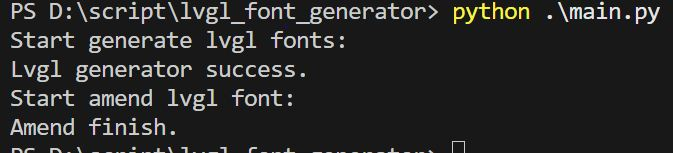
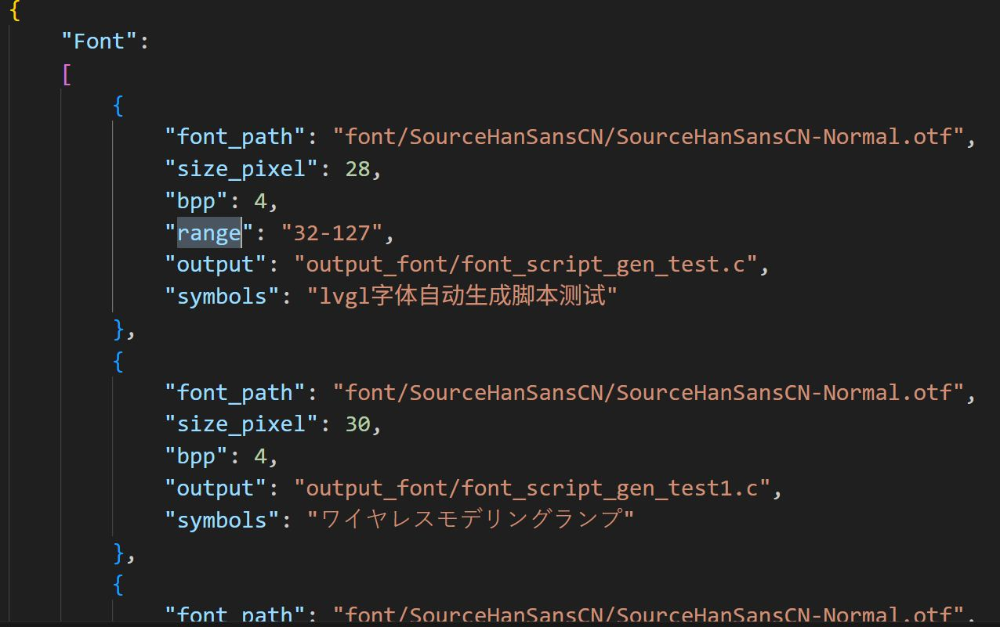

# lvgl字体生成脚本
## 功能
通过命令行调用lv_font_conv工具，批量生成lvgl字体（并修改头文件路径防止项目中报错），提高UI开发效率

## 使用
配置config.json文件，将期望生成的字体配置写入, 然后运行 main文件。**"font"字段**的对象越多，生成的字体更多，如下图。

## 依赖
### 1.安装nodejs
### 2.使用npm安装 lv_font_conv
    npm install -g lv_font_conv
## tip
    重新执行后，旧的输出字体会被覆盖